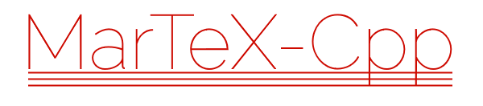

Once upon a time the website committee of Marie-Curie decided it would be nice to have a __TeX-to-HTML__ converter because all physics students must be familiar with LaTeX. The first version was a [horrible regex-based monstrosity](https://github.com/thijsmie/MarTeXPHP) that you can go and look at and shiver in horror. This version, however, is actually practical to use!

Go to the [in-browser preview](https://tmiedema.com/martex) to try it!

## Getting Started

### Prerequisites

MarTeX-Cpp can be built as a module for several other languages. Currently supported are _PHP_, _FFI_ and _WebAssembly_ and an option to build as a simple utility using standard i/o.

A common dependencies for all module options is a C++ compiler with full C++11 support (gcc 4.8.1 or higher, clang 3.3). The makefile is set up to work with gcc but this can be easily changed in the config files.

MarTeX-Cpp's _PHP_ module was tested with _PHP_ versions 7.1, 7.2 and 7.3. To build it you first need your relevant php development package and then you need to install the [PHP-CPP](http://www.php-cpp.com/) library. Please checkout the repository of php-cpp with commit hash 7b975bd1df65174d79241e555ef82c7f9c3538a2 to ensure matching versions.

MarTeX-Cpp's _WebAssembly_ module uses the [emscripten](https://kripken.github.io/emscripten-site/) compiler. Make sure the _em++_ command is on your PATH by sourcing emsdk_env.sh.

MarTeX-FFI and the simple MarTeX-Cpp utility program have no further dependencies.

### Installing

If you have obtained a clone of the repository you can build the project:

#### As _PHP_ module:

If you are running PHP version 7.4 it is recommended you use the MarTeX FFI version instead. Find an example way to call into the FFI system in res/martex.php and res/martex_ffi_c.h. For older versions use this method:

```
make target=php
```
this will result in a php extension called martex.so in the bin folder. You can find out where to put it by typing:
```
php-config --extension-dir
```
Now you need to add "extension=martex.so" to your php.ini file or add it as separate .ini (example in res/martex.ini) in the php loading process. Your milage may vary but the location of these .ini's is /etc/php/7.1/mods-available on my system. You should then be able to use:
```
phpenmod martex
```
to activate the module.

#### As _WebAssembly_ module:
```
make target=wasm
```
This will yield a martex.wasm and a martex.js file in the bin folder. Host these with a webserver to run MarTeX-Cpp directly in a browser. The file res/wasm.html demonstrates the usage.

#### As _FFI_ module:

Call into MarTeX as a standard C library. Compile the .so file using:
```
make target=ffi
```
Use the resulting libmartexffi.so together with martex_ffi_c.h from the res folder. A php ffi wrapper is already available. To use the library system-wide put in a folder like /usr/lib.

#### As simple utility
```
make target=cpp
```
This will yield a file martex in the bin folder. It takes TeX over standard input, will output the result over standard output and report errors over standard error.

## Tests

You might complain that my test file format is weird and is annoying to parse. I like it however, because it allows you to describe tests in however much detail you want and is also language independant, which is important because I would like to be able to run the tests in whatever module form I desire. 

## Project structure

```
martex-cpp
├── bin                 # build output
├── config              # makefile environment variables for different targets
├── documentation       # MarTeX usage documentation rendered with MarTeX-Cpp
├── obj                 # object and dependency files
├── res                 # resources
├── src                 # source code
│   ├── core            # the common core code for all targets
│   │   ├── language    # implementation of the TeX language parser
│   │   ├── modules     # standard library of commands and environments
│   │   └── util        # utility functions, mostly string checks
│   ├── cpp             # simple utility source
│   ├── php             # Php module source. Most code has to do with conversion of values.
│   ├── ffi             # FFI module source.
│   └── wasm            # Webassembly module source.
└── tests               # Tests in old php style.
```

## Contributing

Please feel free to submit anything!

### Bug Bounty Program

If you find a way insert arbitrary html tags and/or get javascript execution from a certain input string then first I'd like to congratualate you on a job well done! Please contact me privately with said input and we'll work on pushing out a fix as quickly as possible. Because I'm still a student there is unfortunately no hard cash to be made here, but certainly there is coffee and cake in it for you!

## Authors

* **Thijs Miedema** - [thijsmie](https://github.com/thijsmie)

## Acknowledgments

Thanks to my committee for their endless patience and enthusiasm while listening to me whining on about this.

Thanks to [**Diego Perini**](https://www.iport.it) for writing a nifty regex-based URL validator.

## License

This project is licensed under the MIT License - see the [LICENSE.md](LICENSE.md) file for details
